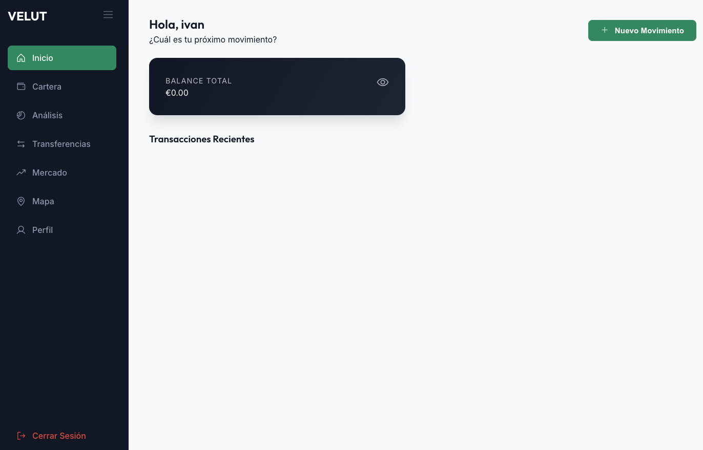

# VELUT — Gestión Financiera Personal

> **VELUT** es una aplicación web multiplataforma diseñada para el control, análisis y seguimiento integral de las finanzas personales en tiempo real.



---

## 🛠️ Características Principales

*   **Autenticación de Usuarios:** Sistema de inicio de sesión y registro seguro con credenciales (correo/contraseña) e integración con proveedores OAuth (Google).
*   **Gestión de Movimientos (CRUD):** Creación, lectura, actualización y borrado de registros financieros (ingresos y gastos).
*   **Panel de Control (Dashboard):** Visualización centralizada del balance total y listado de transacciones recientes.
*   **Módulos de Análisis y Mercado:** Secciones dedicadas para la gestión de cartera, análisis gráfico, transferencias, consulta de mercado y geolocalización.
*   **Almacenamiento e Integración de Ficheros:** Gestión de documentos adjuntos (comprobantes, imágenes, archivos PDF) y almacenamiento local mediante LocalStorage / IndexedDB.
*   **Diseño Multiplataforma y Responsivo:** Interfaz adaptable a diferentes resoluciones de pantalla con soporte multiidioma.

---

## 🚀 Tecnologías Utilizadas

| Categoría | Tecnología / Herramienta |
| :--- | :--- |
| **Frontend** | HTML5, CSS3, JavaScript |
| **Backend & BD** | Supabase / Firebase (Autenticación, Base de Datos CRUD, Storage) |
| **Persistencia** | LocalStorage / IndexedDB / JSON Local |
| **Servicios** | APIs externas para datos de mercado |

---

## 📸 Capturas de Pantalla

| Pantalla de Acceso | Dashboard Principal |
| :---: | :---: |
|  |  |

---

## ⚙️ Requisitos e Instalación

1.  **Clonar el repositorio:**
    ```bash
    git clone [https://github.com/ivanZsasz/velut-finance-app.git](https://github.com/ivanZsasz/velut-finance-app.git)
    ```
2.  **Abrir el proyecto:**
    Abrir el archivo `index.html` en cualquier navegador web o desplegar con una extensión como *Live Server* en VS Code.

---

## 📄 Licencia

Proyecto desarrollado dentro del Grado Superior de Desarrollo de Aplicaciones Multiplataforma (DAM).
